<!-- 标题 + 个人描述, emoji 取自: http://emojihomepage.com -->

<h1 height="200px" align="center">
God dag , I'm 苏年璟
</h1>

A Sometimes passion ✨ and sometimes idle 🥋 frontend developer from China 👨‍💻

<!-- 
技术栈标签, 小标签来自: https://shields.io/
1. shields 链接格式: https://img.shields.io/badge/-{标签文本}-{标签背景色}?style={标签类型}&logo={标签前面 Logo}&logoColor={Logo 颜色}
2. shields 可选 Logo 列表参考: https://github.com/simple-icons/simple-icons/blob/develop/slugs.md
-->

  
  
  
  
  
  
  
  

  
  
   
  
  
  

  
  
  
  
  
  

  
  
  
  

<!-- 背景图 -->
 
 

<!-- 关于我 -->
<h2 height="200px" align="center">🎉 About Me</h2>
 

- 🏋 I'm passionate about fitness, and it pays off ~
- 👨‍💻 I'm passionate about coding and have been developing my skill ~
- ⛺️ I have a private site: [苏年璟](http://sunianjing.top), you're welcome to come! ~

<!-- 贪吃蛇, 由工作流定时生成 -->
<picture>
<source media="(prefers-color-scheme: dark)" srcset="./assets/github-snake-dark.svg" />
<source media="(prefers-color-scheme: light)" srcset="./assets/github-snake.svg" />

</picture>

 
 
<h3 align="center">Activities</h3>

<!-- 活动 -->
<!-- <h3 align="center">Activities</h3>
<table align="center">
<tr>
<td align="center" width="45%" valign="top">

<b><em><spam>Statistics</spam></em></b>

